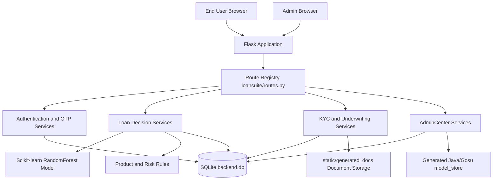
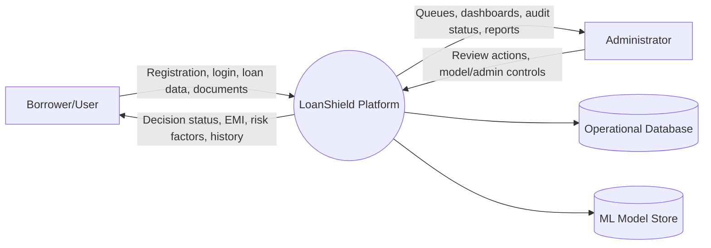
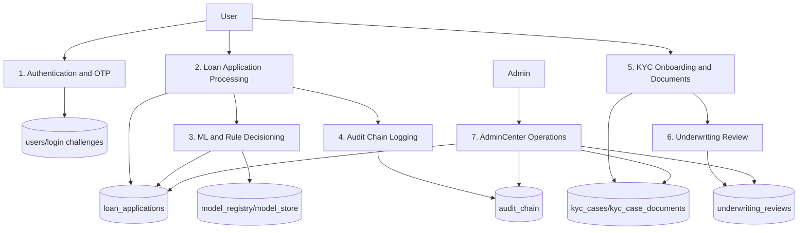
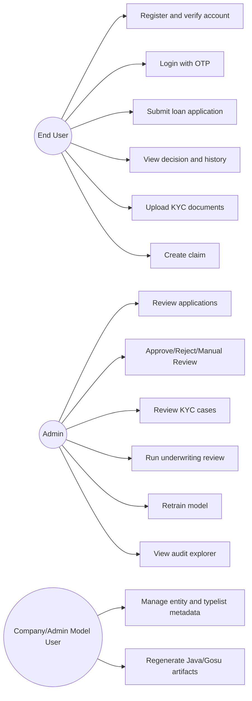
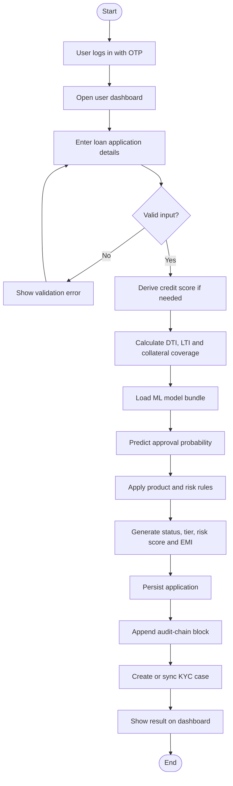
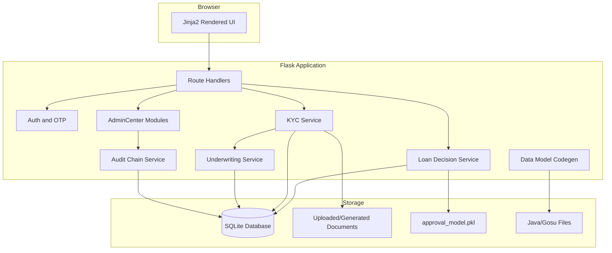
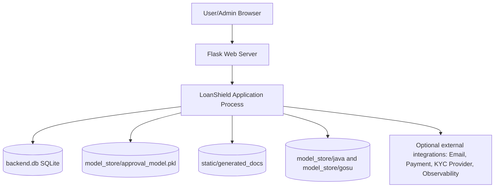
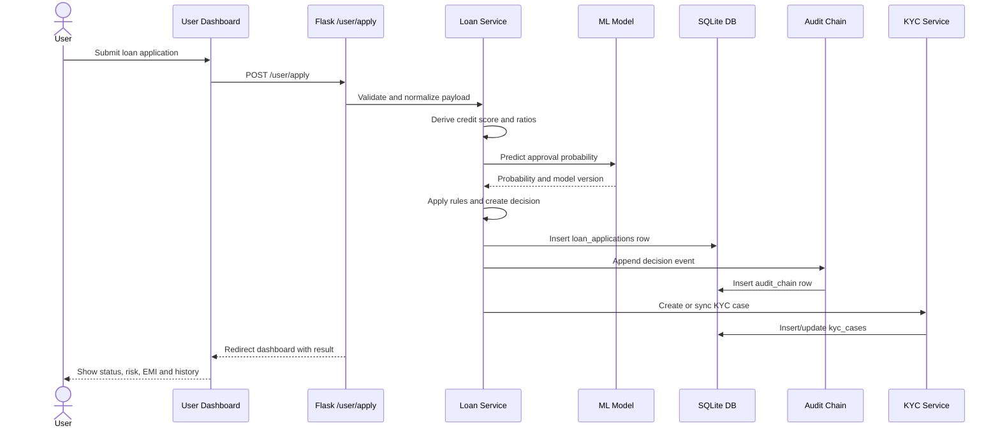
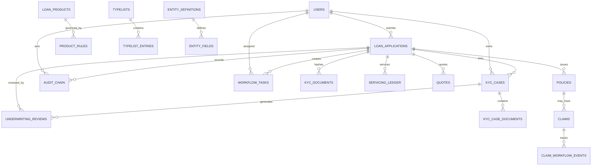

# LoanShield Project Report Submission Content

Date: 2026-04-29

This document is aligned with the current LoanShield repository implementation. The active integrated runtime is a Flask web application with SQLite, Jinja2 templates, scikit-learn based loan decisioning, KYC/underwriting workflows, AdminCenter modules, audit-chain tracking, and generated Java/Gosu data model artifacts.

---

# ABSTRACT

LoanShield is an intelligent loan analysis and prediction platform developed to support digital lending workflows through secure web access, machine learning based decision support, KYC verification, underwriting review, and administrative governance. The project is implemented primarily as a Flask web application with SQLite as the operational database, Jinja2 templates for the user and admin portals, and a scikit-learn RandomForest model for approval intelligence.

The system allows users to register, verify login through OTP, submit loan applications, upload KYC documents, view application history, and track decision outcomes. During loan submission, the application validates borrower information, derives or accepts credit score values, calculates financial ratios such as debt-to-income and loan-to-income, selects an applicable loan product, and generates approval probability, risk score, decision tier, monthly EMI estimate, and recommended safer amount. The output is not based only on machine learning; it is also controlled by deterministic product and risk rules, making the decisioning process more suitable for financial workflows.

LoanShield also provides an AdminCenter for operational monitoring. Administrators can view application queues, high-risk cases, manual review records, KYC cases, underwriting recommendations, model registry details, audit-chain records, typelists, generated model artifacts, and specialized modules such as PolicyCenter, ClaimCenter, BillingCenter, Fraud Graph, Security Center, Rules Engine, Observability, and Notification Orchestration. Important business actions are appended to a hash-linked audit chain to improve traceability and tamper detection.

The project demonstrates how artificial intelligence, workflow automation, secure authentication, explainable risk factors, and role-based dashboards can be combined to create a practical digital lending platform. It supports Sustainable Development Goal 9 by promoting innovation, resilient digital infrastructure, and technology-driven financial service modernization.

Keywords: Loan Prediction, Flask, SQLite, Machine Learning, RandomForest, KYC, Underwriting, AdminCenter, Audit Chain, Financial Technology, Digital Lending.

---

# TABLE OF CONTENTS

| Chapter No. | Title | Page No. |
|---|---|---|
| - | Abstract | iv |
| - | Table of Contents | v |
| - | List of Figures | vi |
| - | List of Tables | vii |
| - | Abbreviations | viii |
| 1 | Introduction | 1 |
| 1.1 | Introduction to Project | 2 |
| 1.2 | Motivation | 3 |
| 1.3 | Problem Statement and Description | 4 |
| 1.4 | Sustainable Development Goal of the Project | 5 |
| 1.5 | Product Vision Statement | 5 |
| 1.6 | Product Goal | 6 |
| 1.7 | Product Backlog | 7 |
| 1.8 | Product Release Plan | 8 |
| 2 | Sprint Planning and Execution | 9 |
| 2.1 | Sprint 1: Core Origination and Prediction Engine | 10 |
| 2.1.1 | Sprint Goal with User Stories of Sprint 1 | 11 |
| 2.1.2 | Functional Document | 12 |
| 2.1.3 | Architecture Document | 13 |
| 2.1.4 | UI Design | 14 |
| 2.1.5 | Functional Test Cases | 15 |
| 2.1.6 | Daily Call Progress | 16 |
| 2.1.7 | Committed vs Completed User Stories | 17 |
| 2.1.8 | Sprint Retrospective | 18 |
| 2.2 | Sprint 2: KYC, Underwriting and AdminCenter | 19 |
| 2.2.1 | Sprint Goal with User Stories of Sprint 2 | 20 |
| 2.2.2 | Functional Document | 21 |
| 2.2.3 | Architecture Document | 22 |
| 2.2.4 | UI Design | 23 |
| 2.2.5 | Functional Test Cases | 24 |
| 2.2.6 | Daily Call Progress | 25 |
| 2.2.7 | Committed vs Completed User Stories | 26 |
| 2.2.8 | Sprint Retrospective | 27 |
| 3 | Results and Discussions | 28 |
| 3.1 | Project Outcomes | 29 |
| 3.2 | Committed vs Completed User Stories | 30 |
| 4 | Conclusions and Future Enhancement | 31 |
| - | Appendix A: Research Paper | 32 |
| - | Appendix B: Sample Coding | 34 |

---

# LIST OF FIGURES

| Figure No. | Title |
|---|---|
| Fig. 1.1 | LoanShield Login Page Screenshot |
| Fig. 1.2 | LoanShield Home/Welcome Page Screenshot |
| Fig. 2.1 | User Home Dashboard Screenshot |
| Fig. 2.2 | User Profile Page Screenshot |
| Fig. 2.3 | Loan Simulator Page Screenshot |
| Fig. 2.4 | System Architecture Diagram |
| Fig. 2.5 | DFD Level 0 - LoanShield Context Diagram |
| Fig. 2.6 | DFD Level 1 - Loan Application, KYC and Admin Flow |
| Fig. 2.7 | Use Case Diagram |
| Fig. 2.8 | Activity Diagram for Loan Application Processing |
| Fig. 2.9 | Component Diagram |
| Fig. 2.10 | Deployment Diagram |
| Fig. 2.11 | Sequence Diagram for Loan Submission |
| Fig. 2.12 | Entity Relationship Diagram |
| Fig. 2.13 | KYC Journey Page Screenshot |
| Fig. 2.14 | LoanShield Assistant Screenshot |
| Fig. 3.1 | Mobile App/PWA Page Screenshot |
| Fig. 3.2 | Admin Dashboard Screenshot |

---

# LIST OF TABLES

| Table No. | Title |
|---|---|
| Table 1.1 | Product Backlog with Desired Outcomes |
| Table 1.2 | Product Release Plan |
| Table 2.1 | Sprint 1 User Stories |
| Table 2.2 | Sprint 1 Functional Test Cases |
| Table 2.3 | Sprint 1 Daily Call Progress |
| Table 2.4 | Sprint 1 Committed vs Completed User Stories |
| Table 2.5 | Sprint 2 User Stories |
| Table 2.6 | Sprint 2 Functional Test Cases |
| Table 2.7 | Sprint 2 Daily Call Progress |
| Table 2.8 | Sprint 2 Committed vs Completed User Stories |
| Table 3.1 | Project Outcomes and Goal Alignment |
| Table 3.2 | Overall Committed vs Completed User Stories |

---

# ABBREVIATIONS

| Abbreviation | Expansion |
|---|---|
| AI | Artificial Intelligence |
| API | Application Programming Interface |
| CIBIL | Credit Information Bureau India Limited |
| CRUD | Create, Read, Update, Delete |
| CSRF | Cross-Site Request Forgery |
| DB | Database |
| DFD | Data Flow Diagram |
| DTI | Debt-to-Income Ratio |
| EMI | Equated Monthly Instalment |
| ER | Entity Relationship |
| ETX | Entity Extension |
| EIX | Entity Internal Extension |
| Flask | Python Web Framework |
| HITL | Human-in-the-Loop |
| KYC | Know Your Customer |
| LTI | Loan-to-Income Ratio |
| ML | Machine Learning |
| MVC | Model View Controller |
| OCR | Optical Character Recognition |
| OTP | One-Time Password |
| PWA | Progressive Web Application |
| SDG | Sustainable Development Goal |
| SQL | Structured Query Language |
| SSO | Single Sign-On |
| UI | User Interface |
| UML | Unified Modeling Language |

---

# CHAPTER 1: INTRODUCTION

## 1.1 Introduction to Project

LoanShield is a Guidewire-inspired digital loan platform that brings together loan origination, approval intelligence, KYC verification, underwriting review, auditability, and administrative operations in one application. The project is implemented as a Flask-based web application and uses SQLite for the current local operational database. The main application flow is server-rendered through Jinja2 templates, while the repository also contains additional backend and React/Vite assets for architectural expansion.

The application supports two main operational experiences. The first is the user portal, where a borrower can register, verify identity through OTP-enabled login, submit a loan application, view decision outputs, upload documents, complete KYC onboarding, and monitor application history. The second is the AdminCenter, where administrators can review applications, manage decision queues, verify KYC cases, view underwriting recommendations, retrain the model, explore audit records, manage typelists/entities, and access specialized operational modules.

LoanShield is not limited to a simple approval/rejection classifier. Its decision process combines machine learning and rule-based validation. The model calculates approval probability, while the rules evaluate credit score, DTI, LTI, collateral coverage, employment history, and product eligibility. The platform also records decision factors so that outcomes can be interpreted by the user or administrator.

The implemented domain model includes tables such as users, loan_applications, audit_chain, model_registry, kyc_cases, kyc_case_documents, underwriting_reviews, workflow_tasks, servicing_ledger, loan_products, product_rules, typelists, typelist_entries, entity_definitions, and entity_fields. These database structures support both the user-facing loan journey and the admin-facing operational controls.

## 1.2 Motivation

Loan processing in many institutions still depends on repeated manual verification, paper-based documentation, disconnected systems, and subjective decision-making. These issues can create delays for applicants and operational risks for lenders. A borrower may not know why an application is delayed or rejected, while an administrator may need to manually compare income, EMI burden, documents, collateral, and policy rules before taking action.

The motivation for LoanShield is to demonstrate how digital lending can be made faster, more transparent, and more reliable. A structured platform can reduce manual effort by collecting borrower information online, calculating risk indicators automatically, supporting approval predictions using machine learning, and routing uncertain cases to manual review. The KYC and underwriting modules add practical realism because financial institutions cannot depend only on model output; they must also verify identity, employment, repayment capacity, and document quality.

The project is also motivated by enterprise financial platforms where multiple operational centers work together. LoanShield adapts that idea by providing AdminCenter modules such as KYC Dashboard, Underwriting Dashboard, Rules Engine, PolicyCenter, ClaimCenter, BillingCenter, Audit Explorer, Fraud Graph, Security Center, Notification Orchestration, Warehouse Export, and Observability.

## 1.3 Problem Statement and Description

### Problem Statement

To design and develop an intelligent loan analysis and prediction platform that enables users to apply for loans online, predicts approval probability using machine learning, verifies KYC and borrower information, supports underwriting recommendations, and provides administrators with role-based tools to manage applications, risks, audit logs, and decision workflows.

### Problem Description

Loan approval is a high-impact financial decision. An incorrect approval can increase default risk, while an incorrect rejection can prevent a genuine borrower from receiving credit. Manual review alone may be slow, inconsistent, and difficult to scale. LoanShield addresses this problem by creating a centralized workflow where loan applications are submitted digitally and evaluated using both data-driven and policy-driven logic.

The platform collects borrower details such as current salary, expenditure, existing EMI, requested amount, tenure, employment years, collateral value, product code, and policy type. If a user does not provide a credit score, the system derives one using income, monthly obligations, requested amount, employment duration, and collateral coverage. After this, the prediction layer calculates approval probability and risk score. The system then assigns decision outputs such as Approved, Manual Review, or Rejected, along with tiers such as Prime, Standard, or High Risk.

After the provisional decision, the KYC workflow creates or syncs a case, records document hashes, supports document upload, extracts text, computes quality signals, identifies parsed fields, and generates verification scores. The underwriting extension calculates safe loan amount and recommendation confidence based on monthly salary, existing EMI, OCR score, mismatches, and work experience. Administrators can then intervene where needed.

## 1.4 Sustainable Development Goal of the Project

### Selected SDG: SDG 9 - Industry, Innovation and Infrastructure

LoanShield aligns most directly with Sustainable Development Goal 9, which focuses on building resilient infrastructure, promoting inclusive and sustainable industrialization, and fostering innovation. The project contributes to SDG 9 by demonstrating a digital financial infrastructure that uses secure software systems, machine learning, auditability, and workflow automation to modernize lending operations.

In the context of financial technology, infrastructure does not only mean physical systems. It also includes reliable software platforms that can process financial requests, maintain data integrity, protect user access, support transparent workflows, and scale operational decision-making. LoanShield contributes to this goal by replacing fragmented manual loan review processes with a structured digital platform.

The project promotes innovation in the following ways:

- It uses machine learning to support approval probability and risk prediction.
- It combines ML output with rule-based policy checks for more responsible decisioning.
- It supports KYC and underwriting workflows that reflect real financial operations.
- It maintains a tamper-evident audit chain for traceability.
- It includes AdminCenter modules that simulate enterprise-grade lending infrastructure.
- It provides a foundation for future integration with credit bureaus, payment gateways, cloud deployment, and external KYC providers.

By supporting digital lending infrastructure, LoanShield can reduce processing delays, improve operational transparency, and encourage technology-driven modernization of financial services. Therefore, SDG 9 is the most appropriate single SDG for this project.

## 1.5 Product Vision Statement

The product vision of LoanShield is to create an intelligent, secure, and transparent digital lending platform that helps borrowers apply for loans easily and helps financial institutions make faster, more consistent, and better-governed lending decisions.

LoanShield aims to act as a complete loan decision-support system by combining user self-service, machine learning prediction, KYC verification, underwriting intelligence, admin governance, audit integrity, and extensible enterprise modules.

## 1.6 Product Goal

The main product goal is to simplify and strengthen the loan approval lifecycle through intelligent automation and role-based workflow management.

Specific goals are:

- Provide secure user registration, login, OTP verification, and session handling.
- Allow users to submit loan applications through a digital dashboard.
- Support multiple loan categories such as car, home, furniture, travel, student, and personal loans.
- Use machine learning to calculate loan approval probability.
- Generate risk score, decision tier, borrower segment, EMI estimate, and safer loan amount.
- Apply product rules such as minimum credit score, maximum DTI, collateral ratio, and required documents.
- Create KYC cases and support document upload/verification.
- Generate underwriting recommendations based on salary, EMI, verification score, and experience.
- Provide admin dashboards for application, KYC, underwriting, model, audit, and module governance.
- Maintain tamper-evident audit records for important events.
- Provide a foundation for future cloud, payment, fraud, compliance, and integration enhancements.

## 1.7 Product Backlog

Table 1.1 Product Backlog with Desired Outcomes

| User Story ID | User Story | Desired Outcome |
|---|---|---|
| US-01 | As a user, I want to register with my basic details so that I can access LoanShield. | User account is created after validation and verification. |
| US-02 | As a user, I want OTP-based login verification so that my account is protected. | Session starts only after successful OTP verification. |
| US-03 | As a user, I want to submit a loan application online so that I can avoid manual branch-based submission. | Loan application is stored in loan_applications. |
| US-04 | As a system, I want to calculate credit score when missing so that decisioning remains complete. | System-generated score is created from salary, EMI, expenditure, loan amount, employment, and collateral. |
| US-05 | As a system, I want to predict approval probability so that users receive quick decision support. | ML output is produced using the model bundle. |
| US-06 | As a system, I want to apply product rules so that approval decisions follow business policy. | Product rule thresholds are checked before final status. |
| US-07 | As a user, I want to view decision status and risk explanation so that I understand the result. | Status, tier, risk score, probability, EMI, and factors are displayed. |
| US-08 | As a user, I want to upload KYC documents so that my identity and employment can be verified. | Documents are stored and linked to a KYC case. |
| US-09 | As a system, I want to analyze KYC document quality and extracted fields so that verification can be automated. | OCR-like parsing, quality label, mismatch flags, and verification score are generated. |
| US-10 | As an admin, I want to view all applications so that I can monitor loan operations. | Admin dashboard lists applications and portfolio metrics. |
| US-11 | As an admin, I want to manually approve, reject, or review applications so that uncertain cases can be handled. | Application status can be updated from AdminCenter. |
| US-12 | As an admin, I want to view KYC and underwriting dashboards so that verification and eligibility can be reviewed. | KYC case status and underwriting recommendations are visible. |
| US-13 | As an admin, I want to retrain the model so that prediction metadata can be refreshed. | model_registry is updated with active model details. |
| US-14 | As a system, I want to append audit-chain events so that key decisions are traceable. | audit_chain stores previous hash, payload digest, nonce, timestamp, and current hash. |
| US-15 | As a company/admin user, I want to manage entity and typelist metadata so that the data model can be extended. | Entity/typelist definitions are stored and Java/Gosu artifacts are generated. |

## 1.8 Product Release Plan

Table 1.2 Product Release Plan

| Release | Scope | Features Included | Expected Outcome |
|---|---|---|---|
| Release 1 | Authentication and User Portal | Registration, login, OTP verification, user dashboard, session handling | Users can securely access the system. |
| Release 2 | Loan Origination and ML Decisioning | Loan form, credit score derivation, ML prediction, risk score, decision tier, EMI estimate | Users can submit applications and receive decision outputs. |
| Release 3 | AdminCenter and Manual Review | Admin login, dashboard, application queues, manual approval/rejection, high-risk queue | Administrators can manage operational decisions. |
| Release 4 | KYC and Underwriting | KYC onboarding, document upload, document quality analysis, underwriting review, safer amount calculation | Applications are supported by verification and eligibility review. |
| Release 5 | Governance and Enterprise Modules | Audit explorer, model registry, rules engine, typelist/entity studio, generated Java/Gosu artifacts, policy/billing/claims modules | Platform becomes more traceable, extensible, and enterprise-like. |

---

# CHAPTER 2: SPRINT PLANNING AND EXECUTION

## 2.1 Sprint 1: Core Origination and Prediction Engine

## 2.1.1 Sprint Goal with User Stories of Sprint 1

Sprint 1 focused on creating the core user-facing workflow. The goal was to complete secure user access, dashboard navigation, loan application submission, data validation, derived credit score calculation, machine learning prediction, and user-visible decision results.

Table 2.1 Sprint 1 User Stories

| ID | User Story | Priority | Acceptance Criteria |
|---|---|---|---|
| S1-US01 | As a user, I want to register and log in securely. | High | User can register, verify, log in, and maintain a valid session. |
| S1-US02 | As a user, I want OTP verification during login. | High | Login session is established only after OTP validation. |
| S1-US03 | As a user, I want to access my dashboard. | High | Dashboard displays form, history, latest decision, and KYC summary. |
| S1-US04 | As a user, I want to submit loan details. | High | Valid form data is accepted and stored. |
| S1-US05 | As a system, I want to validate loan input. | High | Missing or unsafe input is rejected. |
| S1-US06 | As a system, I want to derive credit score if needed. | Medium | Score is clipped between 300 and 900. |
| S1-US07 | As a system, I want to predict approval probability. | High | Model output is generated and combined with rules. |
| S1-US08 | As a user, I want to view my decision status. | High | Approved, Manual Review, or Rejected status is displayed. |

## 2.1.2 Functional Document

Sprint 1 delivered the core loan origination function. The user starts from registration or login, completes OTP verification, reaches the dashboard, and submits a loan application. The submitted data includes product code, policy type, salary, expenditure, existing EMI, requested amount, tenure, employment years, credit score if available, and collateral value.

Functional requirements:

- The system shall provide user registration and login pages.
- The system shall verify login through email OTP challenge records.
- The system shall prevent unauthorized access to user dashboard routes.
- The system shall display a loan application form in the user dashboard.
- The system shall validate numeric and required fields.
- The system shall calculate DTI using monthly expenditure, existing EMI, and monthly income.
- The system shall calculate LTI using requested loan amount and annual income.
- The system shall calculate collateral coverage using collateral value and requested amount.
- The system shall derive credit score if the submitted value is missing or unusable.
- The system shall load or train the ML model bundle.
- The system shall calculate approval probability, risk score, decision tier, interest rate, EMI estimate, and recommended safer amount.
- The system shall persist the application in loan_applications.
- The system shall create an audit-chain event for key actions.
- The system shall display application history and latest decision on the dashboard.

## 2.1.3 Architecture Document

Sprint 1 used a layered Flask architecture:

- Presentation layer: Jinja2 templates such as auth pages and user dashboard.
- Route layer: Flask routes registered in loansuite/routes.py.
- Service layer: business logic in loansuite/services.py and loansuite/ml.py.
- Data layer: SQLite schema initialized through loansuite/db.py.
- ML layer: scikit-learn model stored under model_store/approval_model.pkl.

Fig. 2.4 System Architecture Diagram



Fig. 2.5 DFD Level 0 - LoanShield Context Diagram



## 2.1.4 UI Design

The Sprint 1 UI is implemented using Jinja2 templates. It is designed around role-specific dashboards rather than a static landing page. The user-facing interface includes registration, login, OTP verification, dashboard, application form, latest decision section, application history, and links to KYC and related user modules.

Suggested screenshots:

- Fig. 1.1 LoanShield Login Page Screenshot
- Fig. 1.2 LoanShield Home/Welcome Page Screenshot
- Fig. 2.1 User Home Dashboard Screenshot
- Fig. 2.2 User Profile Page Screenshot
- Fig. 2.3 Loan Simulator Page Screenshot

## 2.1.5 Functional Test Cases

Table 2.2 Sprint 1 Functional Test Cases

| Test Case ID | Scenario | Input | Expected Result | Status |
|---|---|---|---|---|
| TC-01 | User registration with valid details | Username, email, phone, password | Signup challenge is created | Pass |
| TC-02 | Login with valid credentials and OTP | Username, password, OTP | User session is created | Pass |
| TC-03 | Invalid login attempt | Wrong password | Error shown and security counter increments | Pass |
| TC-04 | Submit valid loan application | Complete form data | Application saved and result generated | Pass |
| TC-05 | Submit missing required field | Empty salary or amount | Validation message is shown | Pass |
| TC-06 | Credit score missing | Blank score field | System-derived credit score is used | Pass |
| TC-07 | Low-risk profile | High score, low DTI, good collateral | Approved/Prime result | Pass |
| TC-08 | Medium-risk profile | Moderate score and DTI | Manual Review/Standard result | Pass |
| TC-09 | High-risk profile | Low score, high DTI, weak collateral | Rejected/High Risk result | Pass |
| TC-10 | Dashboard history check | Existing applications | Application list is displayed | Pass |

## 2.1.6 Daily Call Progress

Table 2.3 Sprint 1 Daily Call Progress

| Day | Work Completed | Issues/Risks | Next Action |
|---|---|---|---|
| Day 1 | Finalized core user flow and database requirements. | Scope had many enterprise modules. | Focus on loan origination first. |
| Day 2 | Reviewed routes, templates, and SQLite schema. | Need consistent field mapping. | Connect form payload to service layer. |
| Day 3 | Implemented/verified registration and OTP login flow. | OTP expiry and attempts needed handling. | Add dashboard guard. |
| Day 4 | Prepared user dashboard layout. | UI needed to display both form and history. | Add application form fields. |
| Day 5 | Connected loan submission route. | Numeric conversion errors possible. | Add validation and sanitization. |
| Day 6 | Added credit score derivation logic. | Missing salary/amount could break ratios. | Add safe ratio handling. |
| Day 7 | Integrated ML prediction and model loading. | Model bundle may be absent initially. | Train/load fallback. |
| Day 8 | Stored decision result in loan_applications. | Need audit trace. | Append audit-chain event. |
| Day 9 | Tested Approved, Manual Review, and Rejected cases. | Some thresholds needed clarity. | Document tiering logic. |
| Day 10 | Sprint review and bug fixes. | Minor UI alignment issues. | Move to KYC/Admin features. |

## 2.1.7 Committed vs Completed User Stories

Table 2.4 Sprint 1 Committed vs Completed User Stories

| User Story | Committed | Completed | Remarks |
|---|---|---|---|
| User registration | Yes | Yes | Implemented with validation. |
| OTP login | Yes | Yes | Login email challenge flow available. |
| User dashboard | Yes | Yes | Dashboard shows application and KYC summaries. |
| Loan application form | Yes | Yes | Integrated with /user/apply. |
| Input validation | Yes | Yes | Required and suspicious input checks present. |
| Credit score derivation | Yes | Yes | Implemented in services layer. |
| ML prediction | Yes | Yes | RandomForest model pipeline available. |
| Decision display | Yes | Yes | Status, tier, probability, EMI, and risk shown. |
| Audit event creation | Yes | Yes | Hash-linked audit chain supported. |

## 2.1.8 Sprint Retrospective

What went well:

- The main user journey from login to application result was completed.
- The prediction flow was implemented as a hybrid of ML and rule-based validation.
- SQLite schema initialization made local testing simple.
- Decision outputs were meaningful because they included status, probability, risk score, EMI, and recommendation.

Areas to improve:

- Larger real-world training data would improve model reliability.
- More visual charts could make decision explanation easier for users.
- Validation messages can be made more user-friendly.

Action items:

- Add KYC onboarding and document verification.
- Add admin review dashboards.
- Add underwriting recommendation logic.
- Expand audit explorer and governance modules.

## 2.2 Sprint 2: KYC, Underwriting and AdminCenter

## 2.2.1 Sprint Goal with User Stories of Sprint 2

Sprint 2 focused on extending the core loan prediction workflow into a more complete operational lending platform. The goal was to add KYC cases, document upload, document quality analysis, underwriting recommendation, admin dashboards, manual decision controls, audit explorer, and enterprise-style modules.

Table 2.5 Sprint 2 User Stories

| ID | User Story | Priority | Acceptance Criteria |
|---|---|---|---|
| S2-US01 | As a user, I want to complete KYC onboarding. | High | KYC case is created and updated by step. |
| S2-US02 | As a user, I want to upload documents. | High | File metadata, text, score, and status are stored. |
| S2-US03 | As a system, I want to analyze document quality. | High | Quality label and details are generated. |
| S2-US04 | As a system, I want to compare document fields with KYC profile. | High | Mismatch flags and verification score are generated. |
| S2-US05 | As a system, I want to run underwriting review. | High | Safe loan, eligible amount, status, and explanation are saved. |
| S2-US06 | As an admin, I want to view applications and KYC cases. | High | Admin dashboards show queues and case details. |
| S2-US07 | As an admin, I want to manually update decisions. | High | Admin can approve, reject, or send to manual review. |
| S2-US08 | As an admin, I want to inspect audit events. | Medium | Audit explorer lists chain events and verification status. |
| S2-US09 | As an admin/company user, I want to manage typelists and entities. | Medium | Metadata is stored and generated Java/Gosu artifacts are visible. |

## 2.2.2 Functional Document

Sprint 2 delivered the operational layer of the application. The KYC module stores case profiles with fields such as full name, email, phone, PAN number, Aadhaar last four digits, company name, designation, years of experience, monthly salary, requested loan, and existing EMI. Uploaded documents are stored with parsed fields, extracted text, verification score, mismatch flags, quality label, and status.

Functional requirements:

- The system shall create or retrieve a KYC case for the logged-in user.
- The system shall allow step-wise KYC onboarding.
- The system shall accept KYC document uploads from user workflows.
- The system shall store document metadata in kyc_case_documents.
- The system shall calculate document quality indicators such as blur, noise, contrast, skew, and text density.
- The system shall parse fields such as PAN, employee name, company name, salary, joining date, and salary credits where available.
- The system shall update verification score and case status.
- The system shall run extended underwriting after KYC/document changes.
- The system shall calculate safe loan amount using monthly salary and EMI.
- The system shall save underwriting review records.
- The admin shall access KYC and underwriting dashboards.
- The admin shall approve, reject, or move KYC cases to manual review.
- The admin shall trigger demo document generation for simulation.
- The admin shall access audit, rules, model, security, compliance, integration, and observability modules.

## 2.2.3 Architecture Document

Fig. 2.6 DFD Level 1 - Loan Application, KYC and Admin Flow



Fig. 2.7 Use Case Diagram



Fig. 2.8 Activity Diagram for Loan Application Processing



Fig. 2.9 Component Diagram



Fig. 2.10 Deployment Diagram



Fig. 2.11 Sequence Diagram for Loan Submission



Fig. 2.12 Entity Relationship Diagram



## 2.2.4 UI Design

Sprint 2 added the extended user and admin experience. The selected screenshots focus on the practical pages shown during demonstration: KYC journey, LoanShield Assistant, mobile/PWA experience, and the admin dashboard.

Suggested screenshots:

- Fig. 2.13 KYC Journey Page Screenshot
- Fig. 2.14 LoanShield Assistant Screenshot
- Fig. 3.1 Mobile App/PWA Page Screenshot
- Fig. 3.2 Admin Dashboard Screenshot

## 2.2.5 Functional Test Cases

Table 2.6 Sprint 2 Functional Test Cases

| Test Case ID | Scenario | Input | Expected Result | Status |
|---|---|---|---|---|
| TC-11 | Create KYC case | User opens KYC onboarding | Case is created or retrieved | Pass |
| TC-12 | Update KYC profile | Personal and employment details | kyc_cases row is updated | Pass |
| TC-13 | Upload KYC document | PAN/salary/bank document | kyc_case_documents row is created | Pass |
| TC-14 | Analyze document quality | Uploaded bytes and extracted text | Quality label and quality details generated | Pass |
| TC-15 | Detect mismatch | Document fields differ from profile | Mismatch flags are stored | Pass |
| TC-16 | Run underwriting | KYC case with salary and EMI | Review is inserted in underwriting_reviews | Pass |
| TC-17 | Admin approve case | Admin decision action | Case status changes to approved | Pass |
| TC-18 | Admin reject case | Admin decision action | Case status changes to rejected | Pass |
| TC-19 | Admin view audit explorer | Audit page request | Audit events are listed | Pass |
| TC-20 | Regenerate model artifacts | Codegen action | Java/Gosu generated files are refreshed | Pass |

## 2.2.6 Daily Call Progress

Table 2.7 Sprint 2 Daily Call Progress

| Day | Work Completed | Issues/Risks | Next Action |
|---|---|---|---|
| Day 1 | Planned KYC, underwriting, and AdminCenter scope. | Many modules could expand scope. | Prioritize KYC and admin review. |
| Day 2 | Verified kyc_cases and document schema. | Needed consistent status naming. | Implement case creation/update. |
| Day 3 | Added KYC onboarding flow. | Step validation needed. | Add profile validation. |
| Day 4 | Added document upload and metadata storage. | File parsing is heuristic. | Add quality and mismatch scoring. |
| Day 5 | Implemented underwriting review. | Edge cases for missing salary. | Add manual review fallback. |
| Day 6 | Built admin KYC and underwriting dashboards. | Admin decisions affect multiple records. | Add decision routes. |
| Day 7 | Added audit explorer and chain verification visibility. | Need readable event payloads. | Improve table display. |
| Day 8 | Added model retraining/admin modules. | Model metrics need documentation. | Add model registry details. |
| Day 9 | Tested end-to-end user-to-admin flow. | Some workflows require sample data. | Add demo document/case support. |
| Day 10 | Completed Sprint 2 review and documentation. | Future cloud deployment remains pending. | Prepare results and future scope. |

## 2.2.7 Committed vs Completed User Stories

Table 2.8 Sprint 2 Committed vs Completed User Stories

| User Story | Committed | Completed | Remarks |
|---|---|---|---|
| KYC onboarding | Yes | Yes | Step-wise case profile supported. |
| Document upload | Yes | Yes | Documents linked to KYC cases. |
| Document quality analysis | Yes | Yes | Blur/noise/contrast/skew/text-density signals generated. |
| Verification score | Yes | Yes | Score and mismatch flags stored. |
| Underwriting review | Yes | Yes | Safe loan and recommendation saved. |
| Admin dashboard | Yes | Yes | Application and operational summaries available. |
| KYC dashboard | Yes | Yes | Admin can review KYC cases. |
| Underwriting dashboard | Yes | Yes | Admin can review recommendation outputs. |
| Manual decision controls | Yes | Yes | Approve/reject/manual review routes available. |
| Audit explorer | Yes | Yes | Audit chain events visible. |
| Data model studio/codegen | Yes | Yes | Entity, typelist, Java/Gosu generation supported. |

## 2.2.8 Sprint Retrospective

What went well:

- KYC and underwriting workflows made the project more realistic.
- AdminCenter provided strong operational visibility.
- Audit-chain support improved trust and traceability.
- Generated Java/Gosu artifacts strengthened the Guidewire-inspired architecture.

Areas to improve:

- OCR extraction is currently heuristic and can be improved with a dedicated OCR library or cloud OCR API.
- The admin dashboards can include richer analytics and filters.
- External integrations such as bureau checks, KYC provider APIs, and payment gateways can be made live.

Action items:

- Improve document intelligence with real OCR.
- Add production-grade PostgreSQL deployment.
- Add external credit bureau integration.
- Expand fraud graph analytics and explainable AI.

---

# CHAPTER 3: RESULTS AND DISCUSSIONS

## 3.1 Project Outcomes

LoanShield successfully delivers a functional intelligent lending platform that goes beyond a basic loan classifier. It includes secure authentication, user loan submission, ML/rule decisioning, KYC case management, underwriting recommendation, admin review, audit tracing, and enterprise-style modules.

Table 3.1 Project Outcomes and Goal Alignment

| Project Goal | Implementation Outcome | Alignment |
|---|---|---|
| Secure user access | Registration, OTP login, password hashing, session control, lockout counters | Achieved |
| Digital loan application | User dashboard and /user/apply workflow | Achieved |
| Credit score support | System-derived score from salary, EMI, expenditure, amount, employment, collateral | Achieved |
| ML-based approval intelligence | RandomForest model and model registry | Achieved |
| Rule-based risk control | DTI, LTI, credit, collateral, product rules, tiering | Achieved |
| User decision transparency | Status, probability, risk score, EMI, recommended amount, factors | Achieved |
| KYC verification | KYC cases, document upload, document parsing, score, mismatch flags | Achieved |
| Underwriting support | Safe loan, eligible amount, risk level, confidence, explanation | Achieved |
| Admin operations | Admin dashboard, KYC dashboard, underwriting dashboard, modules | Achieved |
| Auditability | Hash-linked audit_chain table and explorer | Achieved |
| Enterprise extensibility | Entity/typelist studio and generated Java/Gosu artifacts | Achieved |

Discussion:

The project outcome proves that a digital lending workflow requires multiple connected layers. Machine learning alone is useful for prediction, but lending decisions also require product constraints, KYC verification, manual review, auditability, and administrative governance. LoanShield reflects this by combining ML decisioning with deterministic rules and workflow modules.

The use of SQLite makes the current version easy to run locally, while the schema and Docker assets provide a path toward deployment improvements. The AdminCenter gives the project practical value because administrators can monitor and intervene in high-risk or manually routed cases. The audit-chain mechanism improves accountability by linking event records with previous hashes and payload digests.

## 3.2 Committed vs Completed User Stories

Table 3.2 Overall Committed vs Completed User Stories

| User Story | Committed | Completed | Status |
|---|---|---|---|
| User registration | Yes | Yes | Completed |
| OTP authentication | Yes | Yes | Completed |
| Login security and lockout | Yes | Yes | Completed |
| User dashboard | Yes | Yes | Completed |
| Loan application form | Yes | Yes | Completed |
| Credit score calculation | Yes | Yes | Completed |
| ML approval prediction | Yes | Yes | Completed |
| Risk score generation | Yes | Yes | Completed |
| EMI estimate | Yes | Yes | Completed |
| Application history | Yes | Yes | Completed |
| KYC onboarding | Yes | Yes | Completed |
| KYC document upload | Yes | Yes | Completed |
| Document quality scoring | Yes | Yes | Completed |
| Underwriting recommendation | Yes | Yes | Completed |
| Admin dashboard | Yes | Yes | Completed |
| Manual approval/rejection | Yes | Yes | Completed |
| Audit chain | Yes | Yes | Completed |
| Model retraining | Yes | Yes | Completed |
| Data model studio | Yes | Yes | Completed |
| Generated Java/Gosu artifacts | Yes | Yes | Completed |

---

# CHAPTER 4: CONCLUSIONS AND FUTURE ENHANCEMENT

## Conclusion

LoanShield successfully demonstrates how machine learning, secure web development, KYC verification, underwriting logic, and administrative workflows can be integrated into a single digital lending platform. The system allows users to apply for loans online, receive decision support, upload verification documents, and track application history. It also allows administrators to manage loan applications, KYC cases, underwriting reviews, model information, audit records, and enterprise-style modules.

The project achieves its main objective by reducing manual effort in loan processing and improving consistency through automated calculations and structured workflows. The hybrid decision model is especially important because it combines ML prediction with rule-based controls, making the decision more explainable and aligned with financial policies.

LoanShield also supports SDG 9 by presenting a software-based financial infrastructure that promotes innovation in lending operations. The platform can be extended into a production-ready system with stronger integrations, cloud deployment, live credit bureau APIs, real OCR, and more advanced analytics.

## Future Enhancements

- Integrate real credit bureau APIs for live CIBIL/credit score verification.
- Replace heuristic document extraction with OCR services such as Tesseract, AWS Textract, Azure Form Recognizer, or Google Document AI.
- Move from SQLite to PostgreSQL for production deployment.
- Add real email/SMS notification providers for OTP and status updates.
- Add payment gateway integration for EMI payments and reconciliation.
- Add more advanced fraud detection using graph analytics and anomaly detection.
- Improve explainable AI by showing top feature contributions for each decision.
- Add role-specific admin permissions beyond basic admin access.
- Add mobile/PWA enhancements for borrower self-service.
- Add multilingual support for wider accessibility.
- Add CI/CD pipeline, automated tests, and deployment monitoring.
- Add data retention, consent management, and compliance reporting enhancements.

---

# APPENDIX A: RESEARCH PAPER

Suggested research paper title:

Intelligent Loan Approval Prediction and Risk Assessment Using Machine Learning and Rule-Based Decision Support

Summary:

Loan approval prediction is a supervised machine learning classification problem in which borrower and financial attributes are used to predict whether an application is likely to be approved. Common input features include income, loan amount, credit history, employment duration, existing obligations, collateral, and repayment capacity. Models such as Logistic Regression, Decision Tree, Random Forest, Support Vector Machine, and Gradient Boosting are often used for this problem.

LoanShield follows this research direction by using machine learning to estimate approval probability. However, it extends a simple prediction model into a practical workflow by adding product rules, KYC verification, underwriting recommendation, admin review, and audit-chain logging. This makes the project more aligned with real financial decision-support systems, where compliance, verification, and human review are as important as predictive accuracy.

Relevance to LoanShield:

- Supports automated loan approval probability prediction.
- Helps classify risk based on borrower financial details.
- Reduces manual processing effort.
- Improves decision consistency.
- Supports transparent and explainable decision factors.
- Complements rule-based underwriting and KYC workflows.

---

# APPENDIX B: SAMPLE CODING

## Sample Credit Score Calculation Logic

Source alignment: implemented in loansuite/services.py as derive_application_credit_score.

```python
def derive_application_credit_score(payload):
    annual_income = float(payload.get("current_salary") or 0.0)
    monthly_income = annual_income / 12.0 if annual_income else 0.0
    monthly_expenditure = float(payload.get("monthly_expenditure") or 0.0)
    existing_emi = float(payload.get("existing_emi") or 0.0)
    requested_amount = float(payload.get("requested_amount") or 0.0)
    employment_years = float(payload.get("employment_years") or 0.0)
    collateral_value = float(payload.get("collateral_value") or 0.0)

    dti = (monthly_expenditure + existing_emi) / (monthly_income or 1.0)
    lti = requested_amount / (annual_income or 1.0)
    collateral_cover = collateral_value / (requested_amount or 1.0)

    score = 690.0
    score += min(85.0, max(0.0, (annual_income - 180000.0) / 1200000.0 * 85.0))
    score += min(45.0, max(0.0, employment_years / 10.0 * 45.0))
    score += min(40.0, max(0.0, min(collateral_cover, 1.0) * 40.0))
    score -= min(170.0, max(0.0, (dti - 0.22) * 240.0))
    score -= min(95.0, max(0.0, (lti - 0.35) * 38.0))

    return max(300, min(900, int(round(score))))
```

## Sample Underwriting Logic

Source alignment: implemented in loansuite/services.py as run_extended_underwriting.

```python
safe_loan = max(0.0, (0.4 * monthly_salary * 48) - (existing_emi * 12))

if monthly_salary <= 0:
    approval_status = "manual_review"
elif existing_emi > monthly_salary * 0.4:
    approval_status = "manual_review"
elif ocr_score < 70:
    approval_status = "manual_review"
elif "salary_credit_inconsistency" in mismatch_flags:
    approval_status = "rejected"
else:
    approval_status = "approved"
```

## Important Route References

| Function Area | Route |
|---|---|
| Welcome | /welcome |
| User registration | /register |
| Registration verification | /register/verify |
| User login | /login |
| Login OTP verification | /login/verify |
| User dashboard | /user/dashboard |
| Loan application submission | /user/apply |
| KYC onboarding | /user/kyc-onboarding |
| Admin login | /admin/login |
| Admin dashboard | /admin/dashboard |
| KYC dashboard | /admin/kyc-dashboard |
| Underwriting dashboard | /admin/underwriting-dashboard |
| Audit explorer | /admin/audit-explorer |
| Model visualizer | /model-visualizer |
| Admin modules index | /admin/modules |
